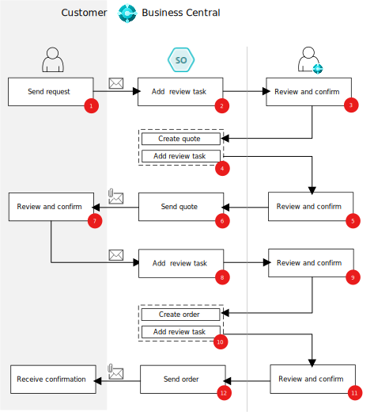

# Sales Order Agent overview (preview)

[!INCLUDE [preview-banner](~/../shared-content/shared/preview-includes/preview-banner.md)]

The Sales Order Agent helps Business Central users automate the entire process of capturing sales orders from their customers. It uses AI to analyze customers’ requests received via email, engage in multi-turn​ e-mail conversations with them, clarifying their requests if important details are missing, checking and informing the customer about availability of the items they are looking for, following up with a sales quote, formatted as a PDF, listing the requested items, quantities, units of measure, prices and taxes and other important details. 

Should the customer decide to update the quote, adding or updating the sales lines, the agent helps with that as well, finding the quote and making the requested changes. When the customer confirms the quote accuracy, the agent proceeds with converting it to a sales order, which is then also shared with the customer via e-mail.   

The agent is readily available in the product. You only need to activate it by specifying an email inbox you want the agent to monitor. You can also specify the users who can use the agent to process cusotmers' orders.

> [!TIP]
> Watch a short video in the Dynamics Business Central channel on YouTube at [Get started with the Sales Order Agent for Dynamics 365 Business Central](https://www.youtube.com/watch?v=6icbmbLc_Og).

[!INCLUDE [preview-note](~/../shared-content/shared/preview-includes/production-ready-preview-dynamics365.md)]

## Operation

The Sales Order Agent uses AI to perform its tasks. Conceptually, it interacts with the Business Central functionality in a similar way Business Central users interact with it. The agent is provided with a general description (or _instructions_), expressed in natural language, of how the process of capturing sales orders should be handled. It then uses the UI elements captions, tooltips and other properties, combined with the data presented on Business Central pages and its instructions to perfrom the task step by step, starting from the designated Role Center, as a user would.  

It operates without human intervention (autonomously) for most tasks, acting on behalf of the company or users, but always keeps users informed and involves them when needed or required in specific scenarios.

Automatically resolves validation errors where possible​

The agent relies on an email dispatcher that continuously monitors a designated mailbox for item requests. The dispatcher triggers the agent to perform tasks and then sends results, such as prepared sales quotes, to the customer in response.

//DRAFT​
Checks available​ inventory, unit of measure, attributes, variants
Can be triggered automatically and on demand, by internal and external processes​

Acts within defined permissions and profile (role)​
Brings humans in the loop to validate key decisions​
, detecting and flagging irrelevant and malicious e-mail content​ ​

Convert sales quotes​ to a sales orders upon salesperson or customer confirmation​​
Composes emails with sales quote as attachment and share it in the same e-mail thread​
Creates and updates sales quotes with requested items, configured pricing and delivery dates​

starting from a customer's request for a quote and concluding with the creation of an order. The agent begins the process by monitoring a designated mailbox for emails that seek a quote for items. From there, it orchestrates a series of tasks, under human supervision, to handle the request and eventually create the order in the system.

Agents can work autonomously, perform assigned tasks, respond to different events and inputs, reason over the state of data, and overcome errors based on user input and the context of the Business Central user experience. Agents require minimal to no intervention from users, while bringing them in if circumstances require their attention. Agents can act on behalf of a company, department, or team, not just a user.  

Learn more in [FAQ for sales order agent](faqs-sales-order-taker-agent.md).

## Process flow

Processing a sales quote request into an order involves three participants: 

- Customer who requests a sales quote via email
- Sales order agent, which monitors the mailbox and handles the incoming request and creates the quote and order  
- Business Central user who reviews agent tasks

The general flow is illustrated in the figure, which is followed by more details of the steps. The actual flow might vary depending on factors such as follow-up requests, changes or cancellations in review, blocking issues, and so one.

1. Customer: Sends email to Business Central mailbox asking for a sales quote for items. 
1. Sales order agent: Picks up unread email from inbox and creates a task with a step for reviewing incoming request. 
1. Reviewer: Reviews/confirms the step with email.  
1. Sales order agent: 

    1. Finds the requested items.
    1. Finds the contact. 
    1. Creates the sales quote. 
    1. Adds review step with a reply email with attached sales quote as pdf.
1. Reviewer: Reviews/confirms email and sales quotes. 
1. Sales order agent: Sends email and sales quote PDF to customer. 
1. Customer: Review sales quote and sends email requesting order. 
1. Sales order agent: Picks up email and adds review step 
1. Reviewer: Reviews/confirms the confirmation email for a sale order. 
1. Sales order agent: 

    1. Converts quote to order. 
    1. Adds review task with outgoing email confirming order. 
1. Reviewer: Reviews/confirms outgoing email. 
1. Sales order agent: Sends email to customer. 
  
## Next steps

- [Set up the sales order agent](sales-order-agent-setup.md)
- [Process sales quotes and orders with sales order agent](sales-order-agent-process.md)

## Related information

[Configure Copilot and AI capabilities](enable-ai.md) 
